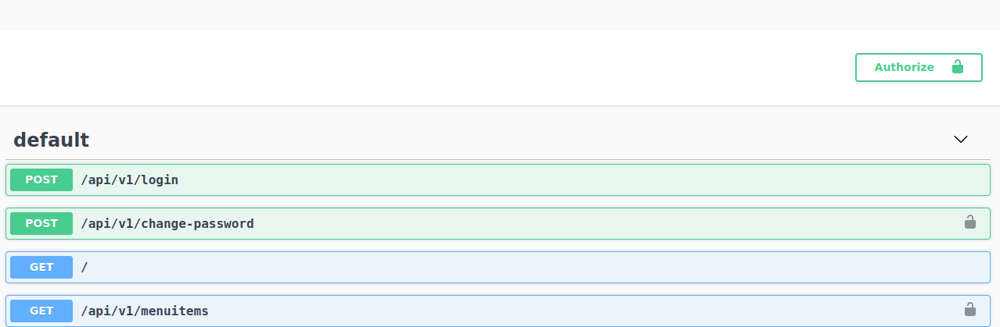

# GoBig-API

## Introduction

GoBig-API is an API backend for restaurants data. There are APIs for managing user, restaurant, and menu data.

## Quick start

Installing docker and [docker-compose](https://docs.docker.com/compose/install/) . I collected all important commands in run.sh file. 

run.sh file categorize the commands into 3 main groups:
1. `containers`: to manage docker container (e.g. start containers).
2. `commands`: to run custom commands on containers except db commands.
3. `database`: to run db commands on mysql db (e.g. migration).
 
- Quick steps to access api using docker:

1. Run `./run.sh start`
2. Run `./run.sh migrate`
3. Run `./run.sh seed_all`
4. Open browser and put [http://localhost:3000/swagger](http://localhost:3000/swagger)
5. Execute login with admin/password.
6. Copy the token.
7. Press Authorize button in the main page.
8. Paste the token inside the value text and press Authorize button on the popup.

9. Now you can execute any API.

## Roles

There are two roles **ADMIN** and **USER**. **ADMIN** has permission on all API calls, while  **USER** has limited permissions. `admin` user has **ADMIN** role but the newly created users will have **USER** role.

## Configuration

Environment file `.env` file is responsible for database and other configuration were you can change database server, port, or database name.

## Database storage

The db engine is `mysql` but can change it to any DBMS type with few changes. You can store data wherever you want and point to it using `.env` file. When you use docker command `./run.sh start` to create and start 2 containers one for **mysql** and the other is for **nodejs**  a container. By default the data is storged in a folder `../mysql`, but you can chage it as you want from `docker-compose.yml`.
